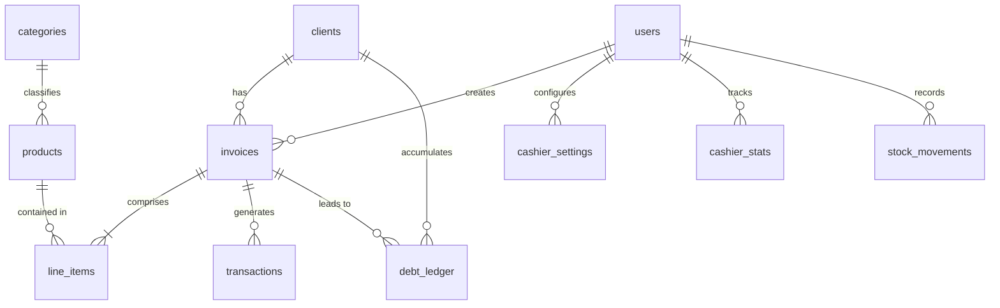
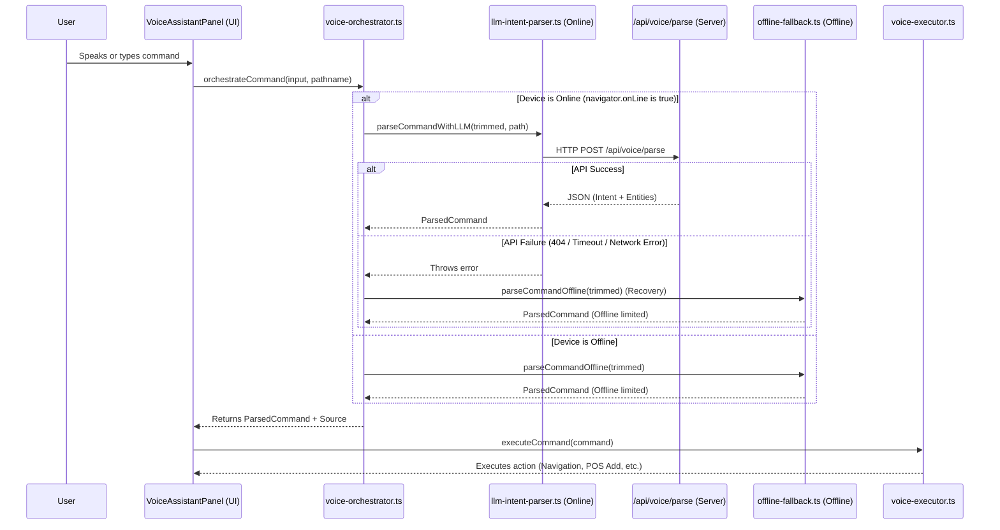

# BarkahFlow — Developer & System Skills Guide

Welcome to the developer guide for **BarkahFlow**, a high-performance, cross-platform (Web, Mobile, Desktop), offline-first Point of Sale (POS) and inventory management system designed for merchants in multi-lingual environments (supporting French, English, and Arabic).

This document serves as an exhaustive reference for the system's architecture, database design, core business modules, integrations, and coding patterns.

---

## 🗺️ Project Architecture & Tech Stack

BarkahFlow is designed as a hybrid application that runs natively on Desktop (via Tauri) and Mobile (via Capacitor), while maintaining a standard web deployment using Next.js.

### 1. Frontend & Core Frameworks
*   **Web Framework:** [Next.js](https://nextjs.org) (v16.2.9) utilizing the **App Router** (`app/` directory).
*   **Library:** [React](https://react.dev) (v19.2.4) & TypeScript.
*   **State Management:** [Zustand](https://github.com/pmndrs/zustand) for client-side reactive state (e.g., POS cart, sidebar toggles).
*   **Styling:** [Tailwind CSS](https://tailwindcss.com) (v4.3.1) alongside standard vanilla CSS for complex graphics (e.g., custom glassmorphism backgrounds like `ShapeGrid.jsx`).
*   **Internationalization:** [i18next](https://www.i18next.com/) supporting French (default), English, and Arabic (RTL layout ready).

### 2. Platform Compilation (Static Export)
Because the app must be packaged into native mobile packages (APK/IPA) and desktop installers (MSI/DMG/Debian), Next.js is configured for **Static HTML Exports**:
*   **Next.js Config (`next.config.ts`):** `output: 'export'` and `images: { unoptimized: true }`.
*   **Capacitor Output Directory (`capacitor.config.json`):** Sets `webDir` to `"out"`.
*   **Tauri Output Directory (`src-tauri/tauri.conf.json`):** Sets `frontendDist` to `../out`.

### 3. Database Layer (SQLite + Supabase Sync)
To support offline-first usage, the primary database is a local SQLite database that communicates with a remote Supabase instance for data synchronization.
*   **Local Driver Wrapper (`src/lib/db.ts`):** Implements `dbSelect` and `dbExecute` which transparently resolve to the correct native driver depending on the running platform:
    *   **Mobile:** Uses `@capacitor-community/sqlite` native SQLite engine.
    *   **Desktop:** Uses `@tauri-apps/plugin-sql` native Rust SQL engine.
    *   **Web Fallback:** Falls back to an in-memory SQL/IndexedDB solution if running on a standard web browser.

---

## 🗄️ Database Schema Design

The SQLite schema (located in `src/lib/schema.sql`) represents a robust commercial model designed for retail flows:



### Table Definitions & Purpose
1.  **`clients`:** Custom names, addresses, contacts, and loyalty/credit limits.
2.  **`categories`:** Product classification with Arabic, English, French names, and custom category colors.
3.  **`products`:** Inventory records containing SKU, barcode, translations (`name_ar`, `name_en`, `name_fr`), pricing (`cost_price` and `retail_price` stored in cents), `stock_qty`, `reserved_stock`, tax rates, supply records, and favorites.
4.  **`invoices`:** Completed checkout headers with invoice number, pricing summary (subtotal, tax, discounts, totals), payment status (`PAID`, `PARTIAL`, `UNPAID`), and payment method.
5.  **`line_items`:** Individual invoice line entries mapping products to sold quantities, unit price, discounts, and item subtotals.
6.  **`transactions`:** Double-entry journal records representing Cash-In (`INCOME`) or Cash-Out (`EXPENSE`), mapping manually entered transactions or linked automatically to invoices.
7.  **`debt_ledger`:** Accounts receivable ledger representing active client debt balances, remaining outstanding dues, and status (`ACTIVE`, `SETTLED`, `PARTIAL`).
8.  **`reminders_queue`:** Notification queues for SMS/WhatsApp debt alerts.
9.  **`users`:** Staff credentials, PIN hash, role (`admin` or `cashier`), permissions JSON array, login lockouts, and online status.
10. **`cashier_settings` & `cashier_stats`:** Operational preferences and historical cashier performance tracking.
11. **`stock_movements`:** Inventory audit logs tracking additions (`IN`), deductions (`OUT`), or adjustments (`ADJUSTMENT`) with reason codes and operator stamps.

---

## 🧠 Core Modules & Technical Details

### 1. POS Checkout Transaction Pipeline (`lib/checkout-process.ts`)
The checkout flow is highly secure, transactional, and incorporates multi-step checks:
*   **Credit/Debt Validation:** Requires a registered `customerId` if the `paymentStatus` is set to `PARTIAL` or `UNPAID`.
*   **Stock Lock Verification:** Performs pre-checkout scans on inventory availability (checking `stock_qty - reserved_stock`). If insufficient, aborts immediately.
*   **Stock Reservation:** Atomically increments `reserved_stock` before inserting records, avoiding race conditions during concurrent user operations.
*   **Monetary Precautions:** Stores all prices, taxes, and discounts in **integers (cents)** to avoid floating-point math issues.
*   **Transaction Logs & Audit Trails:** Deducts stock, releases reservation, inserts transactional income ledger, updates debt ledger (if partial/unpaid), and logs an encrypted record to the audit logging table.
*   **Concurrency Retry Wrapper:** Includes a database lock retry loop (`withRetry`) to handle SQLite write lock scenarios.

### 2. Barcode Scanner & External Lookup System (`lib/barcode-lookup.ts`)
*   **Hardware Interfacing:** Seamlessly connects with native platforms:
    *   Tauri: Uses `@tauri-apps/plugin-barcode-scanner`.
    *   Capacitor Mobile: Integrates `@capacitor-mlkit/barcode-scanning`.
    *   Web/Camera fallback: Uses `html5-qrcode` and `@zxing/browser`.
*   **EAN-13 & UPC-A Variants:** Generates alternative product codes using `barcodeVariants` (e.g. adding leading zeros to 12-digit UPCs or stripping them from 13-digit EANs) to ensure high hit rates.
*   **External Queries:** If a scanned barcode is missing from the local database, it issues parallel requests to **Open Food Facts**, **Open Products Facts**, and **Open Beauty Facts** API endpoints.
*   **Network Guard & Aborts:** Enforces a 15-second timeout via `AbortController` to handle poor cellular networks on portable cash registers.

### 3. Biometric Security & PIN Authorization (`lib/biometric-auth.ts`)
Supports dual-tier security for POS terminals:
*   **Desktop (WebAuthn):** Standard browser/WebView credential registration and assertion via `PublicKeyCredential.isUserVerifyingPlatformAuthenticatorAvailable()`. Uses Windows Hello or Touch ID natively.
*   **Mobile (Native):** Integrates `@aparajita/capacitor-biometric-auth` for Android/iOS.
*   **PIN Codes (`lib/pin-storage.ts`):** Local cashier verification with brute-force lockouts (tracking `failed_pin_attempts` and locking the app via `locked_until` timestamps).

### 4. AI Voice Assistant & Speech Modules (`lib/voice/`)

BarkahFlow integrates artificial intelligence, natural language parsing, fuzzy search, and speech synthesis systems to facilitate hands-free warehouse and merchant operations. Below is a comprehensive analysis of the system architecture, how components interact, and the critical issues causing the system to fallback to offline features even when the device is online.

#### 🗺️ AI Architecture & Execution Flow
The AI assistant works as a coordinated pipeline from speech recognition to structured action execution:



1.  **Orchestration (`lib/voice/voice-orchestrator.ts`):** 
    *   Acts as the main coordinator.
    *   Determines connectivity via `navigator.onLine`.
    *   If online, calls [llm-intent-parser.ts](file:///c:/Users/HP/Desktop/main/barkahflow/lib/voice/llm-intent-parser.ts) to parse via LLM. If that fails (e.g. timeout, rate limit, HTTP error), it degrades to the offline fallback.
    *   If offline, immediately uses [offline-fallback.ts](file:///c:/Users/HP/Desktop/main/barkahflow/lib/voice/offline-fallback.ts).
2.  **Online LLM Engine (`lib/voice/llm-intent-parser.ts`):**
    *   Uses a Next.js server-side route `/api/voice/parse` as a proxy to keep the API key safe.
    *   Enforces JSON output adhering to a strict schema specified in [llm-schema.ts](file:///c:/Users/HP/Desktop/main/barkahflow/lib/voice/llm-schema.ts).
    *   Uses a 15-second timeout via `AbortController` and rejects intents with confidence scores below `0.5`.
3.  **Offline Intent Engine (`lib/voice/offline-fallback.ts`):**
    *   Evaluates local intents under 5ms without network calls.
    *   **Pass 1 (Regex):** Predefined regexes for common French expressions to check commands (confirmations, stats, navigation).
    *   **Pass 2 (Fuse.js Fuzzy Matching):** Runs fuzzy string distances against standard phrases to handle typos, accents, or transcript variations.
4.  **Action Executor (`lib/voice/voice-executor.ts`):**
    *   Exposes `executeCommand` to perform operations (e.g., adding products to cart in [cart-store.ts](file:///c:/Users/HP/Desktop/main/barkahflow/lib/store/cart-store.ts), navigating pages, or fetching stats).
5.  **Text-to-Speech (`lib/voice/voice-feedback.ts`):**
    *   Fires voice confirmation messages back to the cashier in their local language using the native `SpeechSynthesis` API.

---

#### ⚠️ Bug Analysis: Why It Always Falls Back to Offline Features Even When Online
If a user is online, the AI assistant will still fallback to the offline modes/features due to the following critical architectural and configuration bugs:

##### 1. Next.js Static Export Limitations (`output: 'export'`)
*   **The Problem:** BarkahFlow is configured in `next.config.ts` for static HTML exports (`output: 'export'`) to enable native packaging for desktop (Tauri) and mobile (Capacitor).
*   **The Bug:** Next.js static exports **completely strip out** server-side API routes. The proxy route [route.ts](file:///c:/Users/HP/Desktop/main/barkahflow/app/api/voice/parse/route.ts) is not compiled or packaged inside Tauri or Capacitor.
*   **The Impact:** When compiled and run on desktop/mobile, the frontend executes `fetch('/api/voice/parse')`. Because there is no server-side backend on the client device, this fetch will fail with a `404 Not Found` or protocol resolution failure. The orchestrator catches this error and silently degrades to the offline intent engine.

##### 2. Local IP Binding and Network Isolation
*   **The Problem:** In [.env.local](file:///c:/Users/HP/Desktop/main/barkahflow/.env.local), the dev api URL is set to: `NEXT_PUBLIC_API_URL=http://192.168.43.93:3000`.
*   **The Bug:** When running on a mobile device or tablet (Capacitor) using cellular data (4G/5G) or connected to a different network subnet, the private IP address `192.168.43.93` is unreachable.
*   **The Impact:** Although the device is "online" (making `navigator.onLine` true), the fetch call to `http://192.168.43.93:3000/api/voice/parse` times out. The orchestrator handles the exception by routing the request to the offline fallback engine, restricting features.

##### 3. Server-side API Key Isolation
*   **The Problem:** The Gemini API key is configured as `GEMINI_API_KEY` (without the `NEXT_PUBLIC_` prefix) to keep it server-side.
*   **The Bug:** In a static application, there is no server to read `process.env.GEMINI_API_KEY`. As a result, the frontend cannot make direct API requests to Google Generative Language endpoints.
*   **The Impact:** Because client-side queries directly to Gemini would expose the API key (unless highly restricted via GCP referring rules) and require the `NEXT_PUBLIC_` prefix, the app relies entirely on the server route, which fails to run in native builds.

##### 4. Documentation Mismatch
*   **The Bug:** The previous `skill.md` stated that the online system used Groq's `llama-3.3-70b-versatile` model. 
*   **The Reality:** The proxy route [route.ts](file:///c:/Users/HP/Desktop/main/barkahflow/app/api/voice/parse/route.ts) connects directly to Google Generative Language API using the model `gemini-flash-lite-latest`.

---

#### 💡 Recommended Solutions
To solve the online-fallback bug while preserving the offline-first capability of Tauri and Capacitor:

1.  **Expose a Public API Endpoint:**
    *   Deploy the `/api/voice/parse` server route to a cloud platform (e.g. Vercel, Supabase Edge Functions, or a VPS).
    *   Update `NEXT_PUBLIC_API_URL` to point to the production domain instead of a local private IP.
2.  **Enable Direct Client-Side Gemini Requests:**
    *   Create a browser-restricted API key on Google AI Studio (restricted by HTTP Referrer or Package ID).
    *   Store it in `NEXT_PUBLIC_GEMINI_API_KEY` to allow the client to access it.
    *   Modify [llm-intent-parser.ts](file:///c:/Users/HP/Desktop/main/barkahflow/lib/voice/llm-intent-parser.ts) to check if the app is running in a static webview environment (e.g. `window.location.origin` starting with `tauri:` or `capacitor:`). If so, perform the fetch directly to Google's Generative Language API from the client instead of calling the server-side proxy route.
3.  **Active API Endpoint Health Checking:**
    *   Modify `isNetworkAvailable()` in [voice-orchestrator.ts](file:///c:/Users/HP/Desktop/main/barkahflow/lib/voice/voice-orchestrator.ts) to execute a quick head request to the API server to confirm reachability, instead of relying purely on the broad `navigator.onLine` check.

---

*   **Barcode Lookup & Data Aggregation (`lib/barcode-lookup.ts`):**
    *   Integrates native platform APIs (MLKit on Android/iOS via Capacitor community barcode scanning and Tauri Rust-based barcode scanner) to process and parse image data.
    *   Queries Open Food Facts, Open Products Facts, and Open Beauty Facts using parallel, abort-controlled fetch calls to pull missing product metadata (images, French names, brands) from external databases.

---

## 🛠️ Code Conventions & Developer Guidelines

When modifying or expanding BarkahFlow, adhere to these rules:

### 1. Database Operations
*   **Never query Supabase directly in standard POS pages.** All operational transactions (sales, products, clients) must write to SQLite locally via `dbExecute` and `dbSelect` to preserve offline operation.
*   Let the sync daemon handle remote writes in the background.

```typescript
// Correct pattern:
import { dbSelect, dbExecute } from '@/src/lib/db';

const products = await dbSelect<Product>('SELECT * FROM products WHERE is_active = 1');
```

### 2. Multi-Language Translations
*   Always structure user-facing strings using `t('namespace.key')` via the `useTranslation` hook.
*   Update translation files in `lib/i18n/locales/` for French (`fr`), English (`en`), and Arabic (`ar`).

### 3. Role-Based Access Control (RBAC)
*   Prevent administrative options from being shown to cashiers. Protect navigation and interactive features using the `<Guard>` component or `usePermission` hook.

```typescript
import { Guard } from '@/components/rbac/Guard';

<Guard permission="view_reports">
  <button onClick={viewFinancialReports}>Export Financials</button>
</Guard>
```

### 4. Real-Time State Synchronicity
*   When managing checkout transactions, update the global cart using the exported hook `useCart` which synchronizes automatic offline memory states (`localStorage`).

---

## 📦 Native Compilation Checklists

### Tauri Build (Desktop)
Ensure Rust components and system configurations are compiled:
```powershell
npm run tauri build
```
*Configures Windows Hello WebAuthn bindings automatically through system APIs.*

### Capacitor Sync (Mobile)
When changing routes, static pages, or web code, execute sync to native Android and iOS folders:
```powershell
npm run build
npx cap sync
npx cap open android
```
