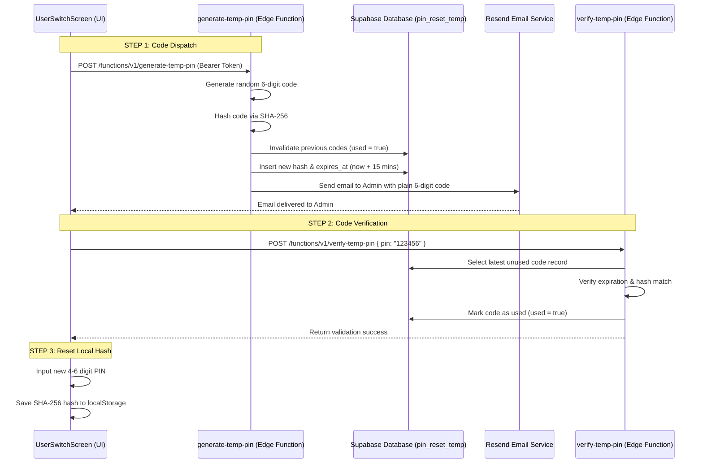

# BarkahFlow — Administrator PIN Restoration Guide

This document describes the design, storage mechanisms, security limitations, and recovery pipeline for the **Administrator PIN Code** in BarkahFlow.

---

## 🔐 Overview & Storage Design

The Administrator PIN code is a 4-to-6 digit numeric credential used to lock the application screen and verify identity when switching between cashier sessions (POS handovers). 

### 1. Local Storage
Unlike database user records synced to Supabase, the active application-level PIN is stored in the browser/webview's **local storage** for offline validation:
*   `barkahflow_pin_hash`: The SHA-256 hexadecimal hash of the admin PIN.
*   `barkahflow_pin_length`: The length of the active PIN (4-6 digits).
*   `barkahflow_pin_lock_enabled`: Boolean flag indicating if screen lock is active.

### 2. Lockout Rules
To prevent brute-force attacks, the local storage tracks attempts:
*   **Soft Lock (3 attempts):** Suspends login inputs for **30 seconds** (tracked via `barkahflow_pin_locked_until`).
*   **Hard Lock (5 attempts):** Suspends login inputs for **5 minutes** (tracked via `barkahflow_admin_pin_locked_until` / `barkahflow_pin_locked_until`) and triggers the recovery pipeline.

---

## 🔄 PIN Restoration Pipeline (Forgot PIN Flow)

When an administrator clicks **"Forgot PIN"** (or triggers a hard lock), the system initiates an email-based recovery process.



### Step 1: Code Generation and Dispatch
1.  The client app requests a temporary code by hitting the `/functions/v1/generate-temp-pin` Supabase Edge Function (see [generate-temp-pin/index.ts](file:///c:/Users/HP/Desktop/main/barkahflow/supabase/functions/generate-temp-pin/index.ts)).
2.  The function generates a random 6-digit numeric string (`generatePin(6)`).
3.  The string is hashed using SHA-256.
4.  The system connects to the database utilizing `SUPABASE_SERVICE_ROLE_KEY` to:
    *   Set `used = true` on any active, unused reset records for the user.
    *   Insert a new row in the `pin_reset_temp` table:
        ```sql
        INSERT INTO pin_reset_temp (user_id, pin_hash, expires_at, used)
        VALUES (user_id, hashed_code, now + 15 mins, false);
        ```
5.  It forwards the plain 6-digit code to the admin's email using the **Resend API**:
    ```typescript
    fetch('https://api.resend.com/emails', {
      method: 'POST',
      body: JSON.stringify({
        from: 'BarkahFlow <onboarding@resend.dev>',
        to: [email],
        subject: 'BarkahFlow - Votre code PIN temporaire',
        html: `... <b>${tempPin}</b> ...`
      })
    })
    ```

### Step 2: Verification of the Temporary Code
1.  The user types the emailed 6-digit code into the UI interface.
2.  The client calls the `/functions/v1/verify-temp-pin` Edge Function (see [verify-temp-pin/index.ts](file:///c:/Users/HP/Desktop/main/barkahflow/supabase/functions/verify-temp-pin/index.ts)).
3.  The backend verifies the request:
    *   Queries the `pin_reset_temp` table for the user's latest unused record.
    *   Validates that the current time has not surpassed the `expires_at` timestamp (15-minute validity window).
    *   Hashes the incoming code and compares it to the stored database hash.
4.  If correct, the backend updates the record (`used = true`) and returns a success response.

### Step 3: Setting a New PIN
1.  Once verified, the UI redirects the administrator to the configuration step (`admin-set-new-pin`).
2.  The admin enters a new 4-to-6 digit PIN twice (to confirm).
3.  The client script calculates the SHA-256 hash of the new PIN and writes it directly to local storage, resetting all local attempt metrics:
    ```typescript
    await setPinCode(newPin);
    ```

---

## 🛠️ Code references

*   **UI switchboard & recovery steps:** [UserSwitchScreen.tsx](file:///c:/Users/HP/Desktop/main/barkahflow/components/pin/UserSwitchScreen.tsx)
*   **State getters and local hash operations:** [pin-storage.ts](file:///c:/Users/HP/Desktop/main/barkahflow/lib/pin-storage.ts)
*   **Standalone recovery page (direct email links):** [page.tsx](file:///c:/Users/HP/Desktop/main/barkahflow/app/auth/reset-pin-confirm/page.tsx)
*   **Generator Edge Function:** [generate-temp-pin/index.ts](file:///c:/Users/HP/Desktop/main/barkahflow/supabase/functions/generate-temp-pin/index.ts)
*   **Validator Edge Function:** [verify-temp-pin/index.ts](file:///c:/Users/HP/Desktop/main/barkahflow/supabase/functions/verify-temp-pin/index.ts)
